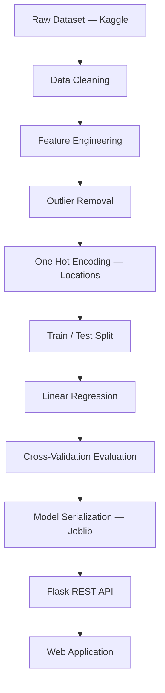
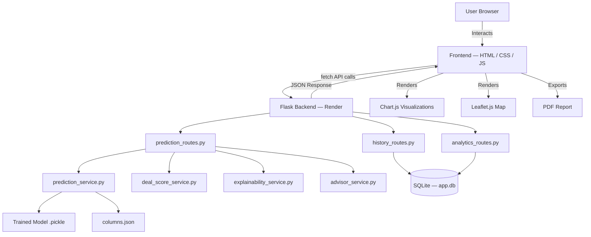

<div align="center">

  
  
  
  
  
  
  
  
  
  
  

  <br /><br />

  <h1>🏠 Bangalore House Price Predictor</h1>

  <p><strong> full-stack Machine Learning web application</strong> that predicts residential property prices across 240+ Bangalore locations — powered by a Linear Regression model trained on 13,000+ real housing records.</p>

  <p>
    <a href="https://bangalore-house-price-prediction-rust.vercel.app/"></a>
    <a href="https://bangalore-house-price-prediction-2xdu.onrender.com/"></a>
    
    
    
  </p>

</div>

---

## 🌐 Live Deployments

| Service | URL | Platform |
|---|---|---|
| **Frontend** | https://bangalore-house-price-prediction-rust.vercel.app/ | Vercel |
| **Backend API** | https://bangalore-house-price-prediction-2xdu.onrender.com/ | Render |

> ⚠️ *Hosted on Render's free tier — the first request after inactivity may take ~30 seconds while the server wakes up.*

---

## 📸 Application Preview

```
assets/
├── home.png
├── prediction.png
```


---

## 📖 Project Overview

The **Bangalore House Price Predictor** is a regression-based Machine Learning application that estimates residential property prices using a trained Linear Regression model. It goes well beyond a simple prediction widget — it's a full-featured real estate intelligence platform with explainable AI, analytics, comparison tools, PDF reporting, map integration, and persistent history tracking.

**Users can enter:**
- 📐 **Area** (Square Feet)
- 🛏 **Number of Bedrooms** (BHK)
- 🛁 **Number of Bathrooms**
- 📍 **Location** (240+ Bangalore localities)

The model instantly returns a predicted price along with a confidence interval, deal quality score, AI-driven insights, and market positioning data — all through a clean, responsive interface.

---

## ✨ Full Feature Set

### 🎯 Core Prediction Engine
- Instant price estimation in **Lakhs** or **Crore** (auto-formatted)
- Confidence interval display (±% price range)
- **Price per sqft** breakdown
- Price category badge: *Budget / Mid-Range / Premium / Luxury* with star rating
- Prediction confidence meter (visual indicator)
- Mini bar-charts comparing area, BHK, and bathroom counts

### ⭐ Deal Quality Score
- Property scored out of 10 based on:
  - Market-relative pricing
  - Price per sqft benchmark
  - Location demand index

### 📍 Location Intelligence
- Location scoring system (Premium Area / Growth Zone / etc.)
- Demand trend highlights and pricing zone classification

### 🧠 AI Price Explainability
- Transparent breakdown of *why* a property has its estimated price
- Factors: location impact, area contribution, BHK/bathroom influence
- Contextual Smart Advisor with family suitability, investment potential, and space efficiency tips

### 📊 Property Comparison Tool
- Compare **up to 3 properties** side-by-side
- Automatically highlights: Best Value, Most Expensive, Balanced Option

### 📈 Analytics Dashboard
- Aggregated dataset-level insights:
  - Average, median, max, and min valuation locations
- Interactive visualizations: Pie charts, Bar charts, Scatter plots (via Chart.js)

### 🕘 Prediction History
- Persistent history via SQLite
- Features: Download as CSV, Generate PDF reports, Delete entries

### 📄 PDF Report Generation
- Export professional property valuation reports
- Includes prediction, deal score, and AI insights

### 🗺️ Map Integration
- Displays selected property location on an interactive map
- Built with OpenStreetMap + Leaflet.js

### 🛡️ Smart Validation (Live, Client-Side)

All validation fires in real time — no submit required.

**Hard Blocks** *(prediction prevented until resolved)*

| # | Rule | Condition | Message |
|---|---|---|---|
| 1 | Area required | Empty or non-numeric field | ⚠ Please enter the property area. |
| 2 | Area too small | Area < 300 sqft | ❌ Area cannot be less than 300 sqft. |
| 3 | Area too large | Area > 10,000 sqft | ❌ Area exceeds the supported limit. |
| 4 | Too many bedrooms | BHK > `floor(area ÷ 220)` | ❌ [area] sqft is too small for [BHK] BHK. |
| 5 | Too many bathrooms | Bathrooms > BHK + 2 | ❌ [BHK] BHK cannot have [bath] bathrooms. |
| 6 | Too few bathrooms | Bathrooms < BHK − 1 | ❌ Too few bathrooms for a [BHK] BHK. |
| 7 | No location | Dropdown left unselected | ⚠ Please select a location before predicting. |

**Soft Warnings & Suggestions**
- **Area > 3,000 sqft:** ⚠ *Large property detected. Prediction accuracy may be slightly lower.*
- **Low bedroom count:** 💡 *This area could comfortably support more bedrooms.*

**Automatic UI Behavior**
- Bathroom options outside `[BHK−1, BHK+2]` are dynamically disabled
- Bathroom auto-resets to valid value on BHK change
- Live re-validation on every keystroke and click

### 🎨 UI / UX
- Modern card-based layout with a hero section
- 🌗 Light / Dark mode toggle (persisted across visits)
- 📱 Fully responsive (desktop, tablet, mobile)
- ⏳ Loading spinner during prediction requests
- ✅ Animated result reveal with success confirmation
- Dynamic Location Dropdown (240+ localities) with visual loading state

---

## 🧠 Machine Learning Pipeline



**Key ML Steps:**
- `total_sqft` column cleaned and averaged from range strings (e.g. `1100–1200` → `1150`)
- Locations reduced from 1,287 to 241 by grouping low-frequency ones as `"other"`
- Area-per-BHK ratio applied for realistic bedroom-size constraints
- Outlier removal using standard deviation thresholds per location
- Model serialized with `joblib` as `.pickle` for fast inference

---

## 📊 Dataset

| Property | Details |
|---|---|
| **Name** | Bengaluru House Data |
| **Source** | Kaggle |
| **Rows** | 13,320 |
| **Columns** | 9 |
| **Locations** | 240+ |
| **ML Task** | Regression |
| **Model** | Linear Regression |
| **Accuracy** | ~95% Confidence |

---

## 🏗️ System Architecture



---

## 📂 Project Structure

```text
Bangalore-House-Price-Prediction/
│
├── Bengaluru_House_Data.csv        # Raw dataset
├── requirements.txt                # Root dependencies
├── wsgi.py                         # WSGI entry point
│
├── jnotebook/
│   ├── BHP.ipynb                   # Model training notebook
│   ├── banglore_home_prices_model.pickle
│   └── columns.json
│
├── server/                         # Flask backend
│   ├── app.py                      # App factory & entry point
│   ├── config.py                   # Environment config
│   ├── app.db                      # SQLite database
│   │
│   ├── artifacts/
│   │   ├── banglore_home_prices_model.pickle
│   │   └── columns.json
│   │
│   ├── routes/
│   │   ├── prediction_routes.py
│   │   ├── history_routes.py
│   │   └── analytics_routes.py
│   │
│   ├── services/
│   │   ├── prediction_service.py
│   │   ├── advisor_service.py
│   │   ├── deal_score_service.py
│   │   ├── explainability_service.py
│   │   ├── location_service.py
│   │   ├── analytics_service.py
│   │   └── pdf_service.py
│   │
│   ├── database/
│   │   ├── db.py
│   │   └── models.py
│   │
│   ├── utils/
│   │   └── helpers.py
│   │
│   ├── static/
│   │   ├── css/                    # Per-page stylesheets
│   │   └── js/                     # Per-page scripts
│   │
│   └── templates/                  # Jinja2 HTML templates
│       ├── home.html
│       ├── predict.html
│       ├── compare.html
│       ├── dashboard.html
│       ├── history.html
│       └── about.html
│
└── vercel-frontend/                # Decoupled static frontend (Vercel)
    ├── index.html
    ├── predict.html
    ├── compare.html
    ├── dashboard.html
    ├── history.html
    ├── about.html
    ├── vercel.json
    └── static/
        ├── css/
        └── js/
            └── config.js           # API base URL config for Vercel build
```

---

## 🛠️ Technologies Used

| Category | Technologies |
|---|---|
| **Language** | Python 3.10+ |
| **Backend** | Flask, Flask-CORS, Gunicorn |
| **Machine Learning** | Scikit-learn, NumPy, Pandas, Joblib |
| **Database** | SQLite (via Flask-SQLAlchemy) |
| **Frontend** | HTML5, CSS3, Vanilla JavaScript (Fetch API) |
| **Visualizations** | Chart.js (analytics), Leaflet.js (maps) |
| **PDF Export** | ReportLab / pdf_service.py |
| **Deployment** | Render (backend), Vercel (frontend) |
| **Version Control** | Git, GitHub |

---

## ⚙️ Local Installation

**1. Clone the repository**
```bash
git clone https://github.com/dhruvikkansagara23-boop/Bangalore-House-Price-Prediction.git
cd Bangalore-House-Price-Prediction
```

**2. Install dependencies**
```bash
pip install -r requirements.txt
```

**3. Start the Flask server**
```bash
cd server
python app.py
```

**4. Open in browser**
```
http://127.0.0.1:5000
```

> The frontend in `vercel-frontend/` is a standalone static build. Open `index.html` directly or point `config.js` to your local API.

---

## 🚀 API Reference

### Get All Locations
```http
GET /get_location_names
```
```json
{
  "locations": ["whitefield", "electronic city", "indira nagar", "..."]
}
```

### Predict House Price
```http
POST /predict_home_price
```
| Parameter | Type | Description |
|---|---|---|
| `sqft` | `float` | Total area in square feet |
| `bhk` | `int` | Number of bedrooms |
| `bath` | `int` | Number of bathrooms |
| `location` | `string` | One of 240+ supported localities |

```json
{
  "estimated_price": 83.52
}
```

### Get Prediction History
```http
GET /history
```

### Download History as CSV
```http
GET /history/download/csv
```

### Generate PDF Report
```http
POST /history/report/pdf
```

### Analytics Overview
```http
GET /analytics/overview
```

---

## ☁️ Render Deployment

| Setting | Value |
|---|---|
| **Build Command** | `pip install -r requirements.txt` |
| **Start Command** | `cd server && gunicorn app:app` |
| **Environment Variable** | `PYTHON_VERSION = 3.10` |

---

## 🩹 Changelog & Fixes

| Version | Change |
|---|---|
| **v2.0** | Full service-layer architecture, SQLite history, analytics dashboard, map integration, PDF export, property comparison |
| **v1.2** | Replaced jQuery CDN with native `fetch()` — fixed `$ is not defined` errors |
| **v1.1** | Smart proportional BHK validation (replaced rigid lookup table); bathroom auto-reset on BHK change |
| **v1.0** | Initial release: Linear Regression model, Flask API, basic HTML frontend, Render deployment |

---

## 📈 Roadmap

- [ ] XGBoost / Random Forest model comparison
- [ ] Recommendation engine (similar properties)
- [ ] Price alert & watchlist system
- [ ] AI Chat Assistant for property Q&A
- [ ] Heatmaps & geo-intelligence overlays
- [ ] User authentication & saved profiles
- [ ] Mobile app version
- [ ] House image upload with visual feature extraction
- [ ] Real-time market trend integration

---

## ⚠️ Limitations

Predictions are **statistical estimates**, not formal valuations. The model does not currently account for:
- Property condition or age
- Floor number or view
- Amenities (gym, parking, pool)
- Real-time market fluctuations

---

## 👨‍💻 Author

**Dhruvik Kansagra**
*MCA Student | Data Science & Machine Learning Enthusiast*

[](https://github.com/dhruvikkansagara23-boop)

---

## ⭐ Support

If this project helped you or you found it interesting, consider giving it a ⭐ on GitHub — it helps others discover it!

---

<div align="center">
  <sub>Built with 🧠 ML + 🐍 Python + ☕ persistence by Dhruvik Kansagara</sub>
</div>