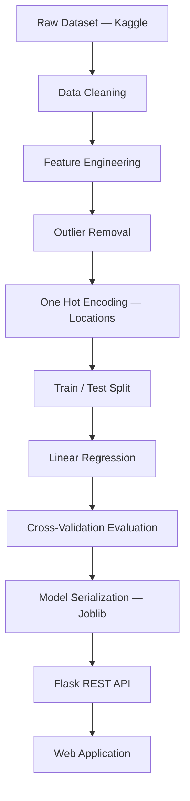
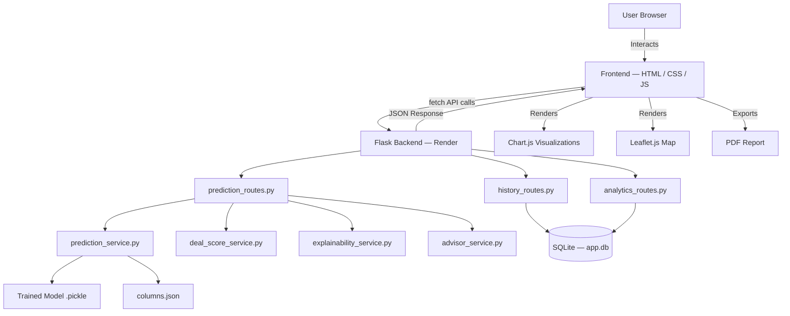

<div align="center">

  
  
  
  
  
  
  
  
  
  
  
  

  <br /><br />

  <h1>🏠 Bangalore House Price Predictor</h1>

  <p><strong>A full-stack Machine Learning web application</strong> that predicts residential property prices across 240+ Bangalore locations — powered by a Linear Regression model trained on 13,000+ real housing records.</p>

  <p>
    <a href="https://bangalore-house-price-prediction-rust.vercel.app/"></a>
    <a href="https://bangalore-house-price-prediction-2xdu.onrender.com/"></a>
    
    
    
  </p>

</div>

---

## 🌐 Live Deployments

| Service | URL | Platform |
|---|---|---|
| **Frontend** | https://bangalore-house-price-prediction-rust.vercel.app/ | Vercel |
| **Backend API** | https://bangalore-house-price-prediction-2xdu.onrender.com/ | Render |

> ⚠️ *Hosted on Render's free tier — the first request after inactivity may take ~30 seconds while the server wakes up.*

---

## 📸 Application Preview

```
assets/
├── home.png
├── prediction.png
```


---

## 📖 Project Overview

Most house-price demos stop at "enter numbers, get a price." This one doesn't. The **Bangalore House Price Predictor** started as a single Linear Regression notebook and grew into a full real-estate intelligence platform — explainable AI, deal scoring, market analytics, map context, PDF reporting, and a persistent history layer, all wrapped around the same core model.

**Users can enter:**
- 📐 **Area** (Square Feet)
- 🛏 **Number of Bedrooms** (BHK)
- 🛁 **Number of Bathrooms**
- 📍 **Location** (240+ Bangalore localities)

The model instantly returns a predicted price along with a confidence interval, deal quality score, AI-driven insights, and market positioning data — all through a clean, responsive interface.

---

## ✨ Full Feature Set

### 🎯 Core Prediction Engine
- Instant price estimation in **Lakhs** or **Crore** (auto-formatted)
- Confidence interval display (±% price range)
- **Price per sqft** breakdown
- Price category badge: *Budget / Mid-Range / Premium / Luxury* with star rating
- Prediction confidence meter (visual indicator)
- Mini bar-charts comparing area, BHK, and bathroom counts

### ⭐ Deal Quality Score
- Property scored out of 10 based on:
  - Market-relative pricing
  - Price per sqft benchmark
  - Location demand index

### 📍 Location Intelligence
- Location scoring system (Premium Area / Growth Zone / etc.)
- Demand trend highlights and pricing zone classification

### 🧠 AI Price Explainability
- Transparent breakdown of *why* a property has its estimated price
- Factors: location impact, area contribution, BHK/bathroom influence
- Contextual Smart Advisor with family suitability, investment potential, and space efficiency tips

### 📊 Property Comparison Tool
- Compare **up to 3 properties** side-by-side
- Automatically highlights: Best Value, Most Expensive, Balanced Option

### 📈 Analytics Dashboard
- Aggregated dataset-level insights:
  - Average, median, max, and min valuation locations
- Interactive visualizations: Pie charts, Bar charts, Scatter plots (via Chart.js)

### 🕘 Prediction History
- Persistent history via SQLite
- Features: Download as CSV, Generate PDF reports, Delete entries

### 📄 PDF Report Generation
- Export professional property valuation reports
- Includes prediction, deal score, and AI insights

### 🗺️ Map Integration
- Displays selected property location on an interactive map
- Built with OpenStreetMap + Leaflet.js

### 🛡️ Smart Validation (Live, Client-Side)

All validation fires in real time — no submit required.

**Hard Blocks** *(prediction prevented until resolved)*

| # | Rule | Condition | Message |
|---|---|---|---|
| 1 | Area required | Empty or non-numeric field | ⚠ Please enter the property area. |
| 2 | Area too small | Area < 300 sqft | ❌ Area cannot be less than 300 sqft. |
| 3 | Area too large | Area > 10,000 sqft | ❌ Area exceeds the supported limit. |
| 4 | Too many bedrooms | BHK > `floor(area ÷ 220)` | ❌ [area] sqft is too small for [BHK] BHK. |
| 5 | Too many bathrooms | Bathrooms > BHK + 2 | ❌ [BHK] BHK cannot have [bath] bathrooms. |
| 6 | Too few bathrooms | Bathrooms < BHK − 1 | ❌ Too few bathrooms for a [BHK] BHK. |
| 7 | No location | Dropdown left unselected | ⚠ Please select a location before predicting. |

**Soft Warnings & Suggestions**
- **Area > 3,000 sqft:** ⚠ *Large property detected. Prediction accuracy may be slightly lower.*
- **Low bedroom count:** 💡 *This area could comfortably support more bedrooms.*

**Automatic UI Behavior**
- Bathroom options outside `[BHK−1, BHK+2]` are dynamically disabled
- Bathroom auto-resets to valid value on BHK change
- Live re-validation on every keystroke and click

### 🎨 UI / UX
- Modern card-based layout with a hero section
- 🌗 Light / Dark mode toggle (persisted across visits)
- 📱 Fully responsive (desktop, tablet, mobile)
- ⏳ Loading spinner during prediction requests
- ✅ Animated result reveal with success confirmation
- Dynamic Location Dropdown (240+ localities) with visual loading state

---

## 🧠 Machine Learning Pipeline



**Key ML Steps:**
- `total_sqft` column cleaned and averaged from range strings (e.g. `1100–1200` → `1150`)
- Locations reduced from 1,287 to 241 by grouping low-frequency ones as `"other"`
- Area-per-BHK ratio applied for realistic bedroom-size constraints
- Outlier removal using standard deviation thresholds per location
- Model serialized with `joblib` as `.pickle` for fast inference

### 🔁 Retraining the Model

The model isn't a black box shipped with the repo — it's fully reproducible from the notebook:

1. Open `jnotebook/BHP.ipynb` in Jupyter or VS Code.
2. Run all cells top to bottom. The notebook reads `Bengaluru_House_Data.csv`, walks through cleaning, outlier removal, and one-hot encoding, then trains and cross-validates the Linear Regression model.
3. The final cells serialize two artifacts:
   - `banglore_home_prices_model.pickle` — the trained model
   - `columns.json` — the ordered feature/column schema the Flask API needs to build prediction inputs correctly
4. Copy both output files into `server/artifacts/` to put the retrained model into production. (A duplicate copy also lives in `jnotebook/` from the original training run — keep both in sync if you retrain.)

> ⚠️ If you change the feature set or column order in the notebook, `columns.json` **must** match what `prediction_service.py` expects, or predictions will silently misalign.

---

## 📊 Dataset

| Property | Details |
|---|---|
| **Name** | Bengaluru House Data |
| **Source** | Kaggle |
| **Rows** | 13,320 |
| **Columns** | 9 |
| **Locations** | 240+ |
| **ML Task** | Regression |
| **Model** | Linear Regression |
| **Accuracy** | ~95% Confidence |

---

## 🏗️ System Architecture



---

## 📂 Project Structure

The application lives in `server/` — that's the version actually deployed to Render. Root-level `routes/`, `services/`, `database/`, and `utils/` are earlier, pre-refactor copies kept in the repo for reference during the service-layer migration; they are **not** imported by the running app. If you're contributing, work inside `server/`.

```text
Bangalore-House-Price-Prediction/
│
├── Bengaluru_House_Data.csv        # Raw dataset
├── requirements.txt                # Root dependencies (used for local/dev installs)
├── test.py                         # Ad-hoc script for manually exercising the prediction pipeline
├── wsgi.py                         # WSGI entry point (alternative to `app:app` — see Deployment)
│
├── routes/ services/ database/ utils/   # Legacy pre-refactor copies — superseded by server/*, kept for reference
│
├── jnotebook/
│   ├── BHP.ipynb                   # Model training / retraining notebook
│   ├── banglore_home_prices_model.pickle   # Original training-run output
│   └── columns.json                # Original feature schema output
│
├── server/                         # Flask backend (this is what's deployed)
│   ├── app.py                      # App factory & entry point
│   ├── config.py                   # Environment config
│   ├── app.db                      # SQLite database
│   ├── requirements.txt            # Server-specific dependencies (used by Render build)
│   │
│   ├── artifacts/
│   │   ├── banglore_home_prices_model.pickle   # Production model copy
│   │   └── columns.json                        # Production schema copy
│   │
│   ├── routes/
│   │   ├── prediction_routes.py
│   │   ├── history_routes.py
│   │   └── analytics_routes.py
│   │
│   ├── services/
│   │   ├── prediction_service.py
│   │   ├── advisor_service.py
│   │   ├── deal_score_service.py
│   │   ├── explainability_service.py
│   │   ├── location_service.py
│   │   ├── analytics_service.py
│   │   └── pdf_service.py
│   │
│   ├── database/
│   │   ├── db.py
│   │   └── models.py
│   │
│   ├── utils/
│   │   └── helpers.py
│   │
│   ├── static/
│   │   ├── css/                    # Per-page stylesheets
│   │   └── js/                     # Per-page scripts
│   │
│   └── templates/                  # Jinja2 HTML templates
│       ├── home.html
│       ├── predict.html
│       ├── compare.html
│       ├── dashboard.html
│       ├── history.html
│       ├── about.html
│       └── app.html                # Shared shell/layout template included by the pages above
│
└── vercel-frontend/                # Decoupled static frontend (Vercel)
    ├── index.html
    ├── predict.html
    ├── compare.html
    ├── dashboard.html
    ├── history.html
    ├── about.html
    ├── vercel.json
    └── static/
        ├── css/
        └── js/
            └── config.js           # Sets the backend API base URL — see note below
```

> **Note on `vercel-frontend/static/js/config.js`:** because the frontend is deployed separately from the Flask API, this file holds the single line that tells the static site where to send its `fetch()` calls — e.g. `export const API_BASE_URL = "https://bangalore-house-price-prediction-2xdu.onrender.com";`. Point it at your own Render URL (or `http://127.0.0.1:5000` for local testing) before deploying or running the frontend standalone.

---

## 🛠️ Technologies Used

| Category | Technologies |
|---|---|
| **Language** | Python 3.10+ |
| **Backend** | Flask, Flask-CORS, Gunicorn |
| **Machine Learning** | Scikit-learn, NumPy, Pandas, Joblib |
| **Database** | SQLite (via Flask-SQLAlchemy) |
| **Frontend** | HTML5, CSS3, Vanilla JavaScript (Fetch API) |
| **Visualizations** | Chart.js (analytics), Leaflet.js (maps) |
| **PDF Export** | ReportLab / pdf_service.py |
| **Deployment** | Render (backend), Vercel (frontend) |
| **Version Control** | Git, GitHub |

---

## ⚙️ Environment Variables

For local development, the app runs with sensible defaults out of the box — no `.env` file is required to get started. If you customize `server/config.py`, the variables it typically reads are:

| Variable | Purpose | Required |
|---|---|---|
| `PYTHON_VERSION` | Pins the Python runtime on Render | Production only |
| `FLASK_ENV` / `FLASK_DEBUG` | Toggles debug mode locally | Optional |
| `DATABASE_URL` | Overrides the default SQLite path if you swap databases | Optional |

> Check `server/config.py` directly for the authoritative list — this table reflects the variables the config module is structured to accept.

---

## ⚙️ Local Installation

### Backend (Flask API)

**1. Clone the repository**
```bash
git clone https://github.com/dhruvikkansagara23-boop/Bangalore-House-Price-Prediction.git
cd Bangalore-House-Price-Prediction
```

**2. Install dependencies**

There are two `requirements.txt` files — the root one is fine for a quick local run; `server/requirements.txt` is what Render actually installs in production, so use that one if you want your local environment to mirror the deployed API exactly.
```bash
pip install -r requirements.txt
# or, to match production exactly:
pip install -r server/requirements.txt
```

**3. Start the Flask server**
```bash
cd server
python app.py
```

**4. Open in browser**
```
http://127.0.0.1:5000
```

### Frontend (decoupled Vercel build)

The frontend in `vercel-frontend/` is a standalone static site — it doesn't need Node, a build step, or the Flask server running on the same machine.

**1. Point it at an API**

Edit `vercel-frontend/static/js/config.js` and set the base URL to either your local Flask server or the live Render deployment:
```js
export const API_BASE_URL = "http://127.0.0.1:5000"; // or your Render URL
```

**2. Open it**

Just open `vercel-frontend/index.html` directly in a browser, or serve the folder with any static file server (e.g. `npx serve vercel-frontend`).

---

## 🚀 API Reference

> ⚠️ The routes below reflect the endpoint names as designed. Prefixes for `history` and `analytics` are defined by the `Blueprint` registration inside `history_routes.py` and `analytics_routes.py` — confirm the exact prefix in those files (or `app.py`'s blueprint registration) before integrating against them, in case a route group has been mounted under a prefix like `/api`.

### Get All Locations
```http
GET /get_location_names
```
```json
{
  "locations": ["whitefield", "electronic city", "indira nagar", "..."]
}
```

### Predict House Price
```http
POST /predict_home_price
```
| Parameter | Type | Description |
|---|---|---|
| `sqft` | `float` | Total area in square feet |
| `bhk` | `int` | Number of bedrooms |
| `bath` | `int` | Number of bathrooms |
| `location` | `string` | One of 240+ supported localities |

```json
{
  "estimated_price": 83.52
}
```

### Get Prediction History
```http
GET /history
```

### Download History as CSV
```http
GET /history/download/csv
```

### Generate PDF Report
```http
POST /history/report/pdf
```

### Analytics Overview
```http
GET /analytics/overview
```

---

## ☁️ Render Deployment

| Setting | Value |
|---|---|
| **Build Command** | `pip install -r requirements.txt` |
| **Start Command** | `cd server && gunicorn app:app` |
| **Environment Variable** | `PYTHON_VERSION = 3.10` |

**About `wsgi.py`:** the repo also ships a root-level `wsgi.py` as an alternative WSGI entry point. If you deploy from the repo root instead of `cd`-ing into `server/`, use `gunicorn wsgi:app` instead of `app:app`. The currently deployed Render service uses the `cd server && gunicorn app:app` form shown above — the two are equivalent, just pointed at different working directories, so pick one and keep your build/start commands consistent with it.

---

## 🩹 Changelog & Fixes

| Version | Change |
|---|---|
| **v2.0** | Full service-layer architecture, SQLite history, analytics dashboard, map integration, PDF export, property comparison |
| **v1.2** | Replaced jQuery CDN with native `fetch()` — fixed `$ is not defined` errors |
| **v1.1** | Smart proportional BHK validation (replaced rigid lookup table); bathroom auto-reset on BHK change |
| **v1.0** | Initial release: Linear Regression model, Flask API, basic HTML frontend, Render deployment |

> **Experimental / removed:** compiled artifacts for a `recommendation_service` and a `chat_service` exist in `server/services/__pycache__/` but their source files aren't in the current tree. These were early explorations toward the "Recommendation engine" and "AI Chat Assistant" roadmap items below and were pulled before the v2.0 release — they'll return once rebuilt against the current service-layer architecture.

---

## 📈 Roadmap

- [ ] XGBoost / Random Forest model comparison
- [ ] Recommendation engine (similar properties) — early prototype existed pre-v2.0, see Changelog
- [ ] Price alert & watchlist system
- [ ] AI Chat Assistant for property Q&A — early prototype existed pre-v2.0, see Changelog
- [ ] Heatmaps & geo-intelligence overlays
- [ ] User authentication & saved profiles
- [ ] Mobile app version
- [ ] House image upload with visual feature extraction
- [ ] Real-time market trend integration

---

## ⚠️ Limitations

Predictions are **statistical estimates**, not formal valuations. The model does not currently account for:
- Property condition or age
- Floor number or view
- Amenities (gym, parking, pool)
- Real-time market fluctuations

---

## 👨‍💻 Author

**Dhruvik Kansagra**
*MCA Student | Data Science & Machine Learning Enthusiast*

[](https://github.com/dhruvikkansagara23-boop)

---

## ⭐ Support

If this project helped you or you found it interesting, consider giving it a ⭐ on GitHub — it helps others discover it!

---

<div align="center">
  <sub>Built with 🧠 ML + 🐍 Python + ☕ persistence by Dhruvik Kansagra</sub>
</div>