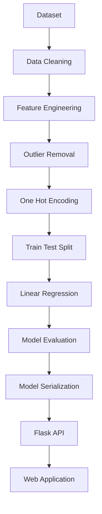
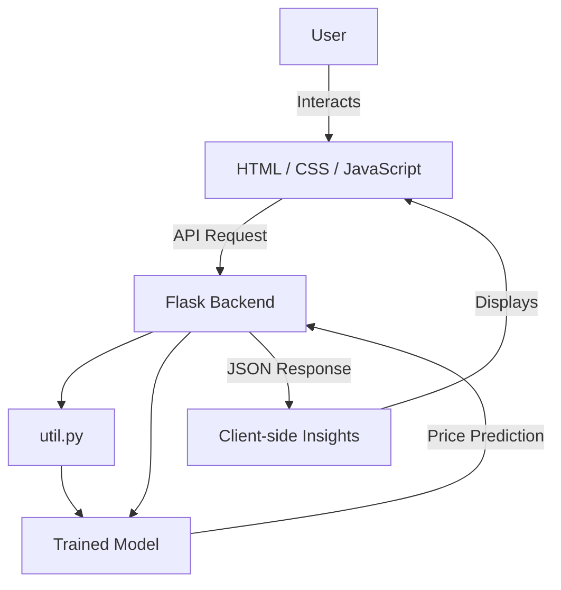

<div align="center">
  
  
  
  
  
  
  
</div>

<h1 align="center">🏠 Bangalore House Price Prediction using Machine Learning</h1>

<p align="center">
  A Machine Learning web application that predicts <strong>Bangalore house prices</strong> based on property features such as <strong>Area, BHK, Bathrooms, and Location</strong>. The application is built with Python, Flask, Scikit-learn, HTML, CSS, and vanilla JavaScript, and is fully deployed on Render.
</p>

---

## 🌐 Live Demo

🔗 **[Live Website](https://bangalore-house-price-prediction-2xdu.onrender.com/)**

> ⚠️ *Hosted on Render's free tier — the first request after a period of inactivity may take ~30 seconds while the server wakes up.*


- **Frontend (Vercel):** https://bangalore-house-price-prediction-rust.vercel.app/
- **Backend API (Render):** https://bangalore-house-price-prediction-2xdu.onrender.com/

---

## 📸 Application Preview

*(Create an `assets` folder and add your screenshots here)*

```
assets/
│
├── home.png
├── prediction.png
```


---

## 📖 Project Overview

The Bangalore House Price Prediction System is a regression-based Machine Learning application that estimates residential property prices using a trained Linear Regression model.

**Users can enter:**
- 📐 **Area** (Square Feet)
- 🛏 **Number of Bedrooms** (BHK)
- 🛁 **Number of Bathrooms**
- 📍 **Location**

The trained model predicts the estimated property price instantly through a Flask REST API, along with a price range, confidence score, category, and personalized insights.

---

## ✨ Features

### 🎯 Core Prediction
- 🏠 Predict Bangalore house prices instantly.
- 📍 Dynamic Location Dropdown (240+ locations), with a clear loading state while it fetches.
- ⚡ Flask REST API Backend, called via native `fetch()` (no external JS library dependency).

### 🛡️ Smart Validation
- 📐 **Area Validation** (300 – 10,000 sqft).
- 🛏 **BHK Selection** (1–7), checked against area using an area-per-bedroom ratio rather than a rigid lookup table.
- 🛁 **Bathroom Selection** (1–7), validated against BHK (*Bathrooms ≥ BHK − 1 and ≤ BHK + 2*).
- 🚫 Invalid bathroom options disabled automatically based on selected BHK.
- 🔄 Live re-validation — errors appear/clear instantly as you change any field, not just on submit.
- ⚠ Inline warnings for unusually large properties (luxury-area threshold).
- 💡 Non-blocking suggestions when a spacious area could support more bedrooms.
- ❌ Clear, inline error messages instead of browser alerts.

### 📊 Prediction Insights
- 💰 Estimated price displayed in **Lakhs** or **Crore** automatically.
- 📊 Possible price range (±7% of estimate).
- 🏷 Price category badge (*Budget / Mid-Range / Premium / Luxury*) with star rating.
- 📈 Prediction confidence meter.
- 📶 Mini bar-charts for area, bedrooms, and bathrooms.
- 🤖 Smart Advisor — contextual tips generated from the entered property configuration.
- 📋 Property Summary card shown alongside the prediction.

### 🎨 UI / UX
- 🎨 Modern, card-based UI with a hero section.
- 🌗 Light / Dark mode toggle (persisted across visits).
- 📱 Fully responsive design (desktop, tablet, mobile).
- ⏳ Loading state with spinner while a prediction is in progress.
- ✅ Animated result reveal with success confirmation.

### ☁️ Deployment
- Deployed on **Render** with auto-deploy on push to `main`.

---

## 🛠 Technologies Used

| Category | Technologies |
|---|---|
| **Programming Language** | Python |
| **Frontend** | HTML5, CSS3, Vanilla JavaScript (`fetch` API) |
| **Backend** | Flask, Flask-CORS, Gunicorn |
| **Machine Learning** | NumPy, Pandas, Scikit-learn, Joblib |
| **Deployment** | Render |
| **Version Control** | Git, GitHub |

---

## 🧠 Machine Learning Workflow



---

## 📊 Dataset Information

| Property | Details |
|----------|----------|
| **Dataset** | Bengaluru House Data |
| **Source** | Kaggle |
| **Rows** | 13,320 |
| **Columns** | 9 |
| **ML Problem** | Regression |

---

## 🏗 Project Architecture



---

## 📂 Project Structure

```text
Banglore_house_price_prediction/
│
├── client/
│
├── jnotebook/
│   ├── BHP.ipynb
│   ├── banglore_home_prices_model.pickle
│   └── columns.json
│
├── project/                     # (or server/)
│   ├── artifacts/
│   │   ├── banglore_home_prices_model.pickle
│   │   └── columns.json
│   ├── static/
│   ├── templates/
│   ├── routes/
│   ├── services/
│   ├── database/
│   ├── app.py
│   └── util.py
│
├── Bengaluru_House_Data.csv
├── requirements.txt
├── README.md
├── LICENSE
└── .gitignore
```

---

## ⚙️ Installation Guide

**1. Clone Repository**
```bash
git clone https://github.com/dhruvikkansagara23-boop/Bangalore-House-Price-Prediction.git
```

**2. Move into Project**
```bash
cd Bangalore-House-Price-Prediction
```

**3. Install Dependencies**
```bash
pip install -r requirements.txt
```

**4. Start Flask Server**
```bash
cd project  # Note: Navigate to wherever app.py is located
python app.py
```

**5. Open Browser**
```text
http://127.0.0.1:5000
```

---

## 🚀 API Endpoints

### Get Locations
```http
GET /get_location_names
```
**Response:**
```json
{
  "locations": ["whitefield", "electronic city", "indira nagar"]
}
```

### Predict Price
```http
POST /predict_home_price
```
**Parameters:**
`sqft`, `bhk`, `bath`, `location`

**Response:**
```json
{
   "estimated_price": 83.52
}
```

---

## 📌 Validation Rules

All validation happens client-side, live, as you interact with the form — no need to click "Estimate Price" to see errors appear or clear.

### 🚫 Hard Blocks
*(Prediction is prevented until fixed)*

| # | Rule | Condition | Message |
|---|---|---|---|
| 1 | Area required | Empty or non-numeric area field | ⚠ Please enter the property area. |
| 2 | Area too small | Area < 300 sqft | ❌ Area cannot be less than 300 sqft. |
| 3 | Area too large | Area > 10,000 sqft | ❌ Area exceeds the supported limit. |
| 4 | Too many bedrooms | BHK exceeds `floor(area ÷ 220)` | ❌ [area] sqft is too small for [BHK] BHK. |
| 5 | Too many bathrooms| Bathrooms > BHK + 2 | ❌ [BHK] BHK cannot have [bath] bathrooms. |
| 6 | Too few bathrooms | Bathrooms < BHK − 1 | ❌ Too few bathrooms for a [BHK] BHK. |
| 7 | No location | Location dropdown left empty | ⚠ Please select a location before predicting. |

### ⚠ Warnings & Soft Suggestions
- **Large property (Area > 3,000 sqft):** ⚠ *Large property detected. Prediction accuracy may be slightly lower.*
- **Bedroom count looks low:** 💡 *This area could comfortably support more bedrooms.*

### 🔄 Automatic UI Behavior
- Any bathroom radio outside `[BHK−1, BHK+2]` is dynamically disabled and unclickable.
- Bathroom auto-resets to a valid value if currently selected count falls outside the new valid range after a BHK change.
- Live re-validation on every keystroke or click.

---

## ☁️ Render Deployment Guide

To deploy this project to Render flawlessly, use the following settings when creating your **Web Service**:

1. **Build Command:**
   ```bash
   pip install -r requirements.txt
   ```
2. **Start Command:**
   ```bash
   cd project && gunicorn app:app
   ```
   *(Note: Ensure you `cd` into the directory where `app.py` is located. If it's named `server`, use `cd server && gunicorn app:app`)*

3. **Environment Variables:**
   - `PYTHON_VERSION`: `3.10` (or whichever version you prefer)

---

## 🩹 Recent Fixes & Changelog

- **Removed jQuery CDN dependency:** Replaced all AJAX calls with native `fetch()` to fix `$ is not defined` errors.
- **Smart BHK Validation:** Replaced rigid BHK-vs-area lookup table with a proportional area-per-bedroom check, fixing false-positive blocks.
- **Bathroom Logic:** Fixed auto-resetting bug when changing BHK values. Live validation messages now clear dynamically via a `change` event listener.
- **Location Loading State:** Added a visual spinner and disabled the Estimate button to prevent submissions before the locations have finished fetching.

---

## 📈 Future Enhancements

- [ ] XGBoost Model / Random Forest Comparison
- [ ] House Image Upload
- [ ] Interactive Price Visualization (advanced charts)
- [ ] Google Maps Integration
- [ ] Nearby Schools & Hospitals
- [ ] User Authentication
- [ ] Downloadable / Shareable Prediction Report
- [ ] Mobile App Version

---

## 👨‍💻 Author

**Dhruvik Kansagra**  
*MCA Student | Data Science & Machine Learning Enthusiast*  
GitHub: [@dhruvikkansagara23-boop](https://github.com/dhruvikkansagara23-boop)

---

## ⭐ Support

If you found this project useful, consider giving it a ⭐ on GitHub!